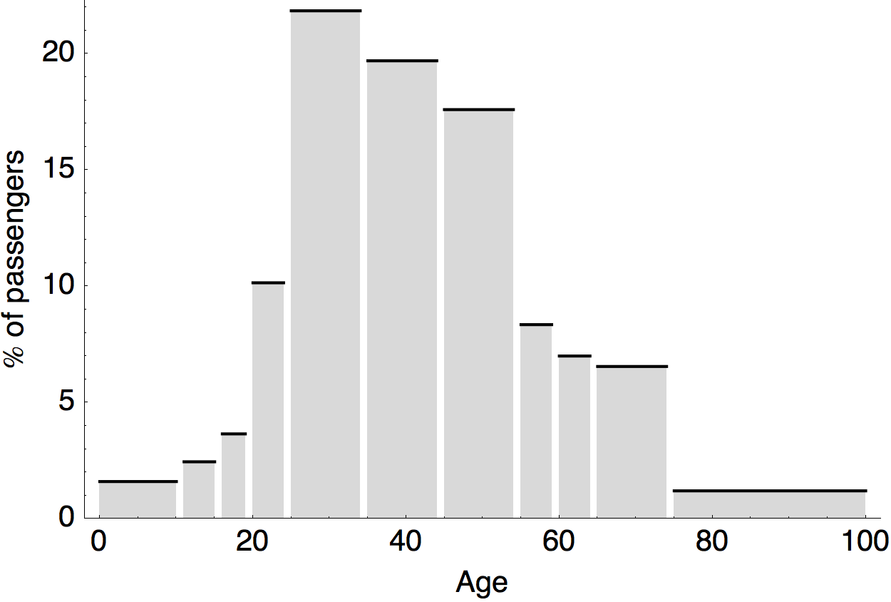
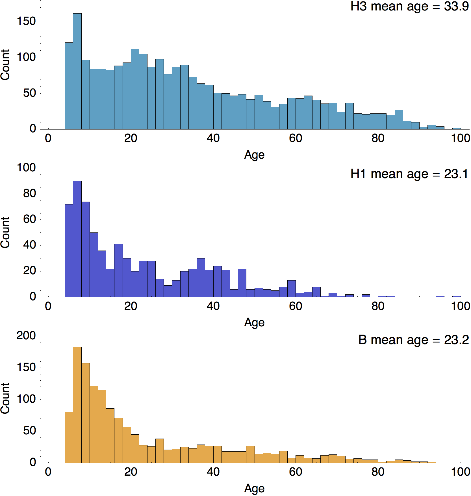

## Air travel by age

Data on air travel comes from the [CAA Passenger Survey Report 2011](http://www.caa.co.uk/docs/81/2011CAAPaxSurveyReport.pdf).  This gives age structure of ~102,495,000 passengers at the two busiest UK airports, [London Heathrow (LHR)](data/heathrow.tsv) and [London Gatwick (LGW)](data/gatwick.tsv) airports in 2011.  During 2011, Heathrow saw 69,222,000 passengers. Gatwick saw 33,273,000.  Bins were averaged between the two airports.

## Incidence by age

Data comes from the Melbourne collaborating center and is given as a table [here](data/melb-isolations.tsv).  Data was restricted to just Australia.  Isolates by age were tallied for H3, H1 and B.  Here, I removed reports from children less than 5.

## Contact rates

Putting this together, we take proportion belonging to age bracket X in travel distribution and multiply this by proportion belonging to age bracket X in incidence distribution.  This gives weighted contact rates.

H3 	 | H1 	| B
---- | ---- | ---
10.3 | 8.7	| 7.2

It doesn't appear that we can get a 2X differential in migration rates between H3 and B from this.  Scaling rates relative to H3 gives:

H3 	 | H1 	| B
---- | ---- | ---
100% | 84%	| 70%

Alternatively, scaling rates to B gives:

H3 	 | H1 	| B
---- | ---- | ---
143% | 121%	| 100%

# Two-compartment model

Age structured model with two-compartments.  These are children (0-15 years) and adults (16+ years).  

## Air travel

The air travel data (combined with population demography) suggests that children travel at 19% of the rate of adults.

## Mixing

[Mossong et al. (2008)](http://dx.doi.org/10.1371/journal.pmed.0050074) give contact rates between people of different ages in Europe.  [Rohani et al. (2009)](http://dx.doi.org/10.1126/science.1194134) show that this contact matrix works extremely well for modeling pertussis.  

This matrix suggests that adults contact adults at 26% of the rate that children contact children and that children contact adults (and vice versa) at 21% the rate that children contact children.

## Incidence

The incidence data suggests that H3N2 infects children 30% of the time and influenza B infects children 60% of the time.  These are targets (not inputs) for the model.

