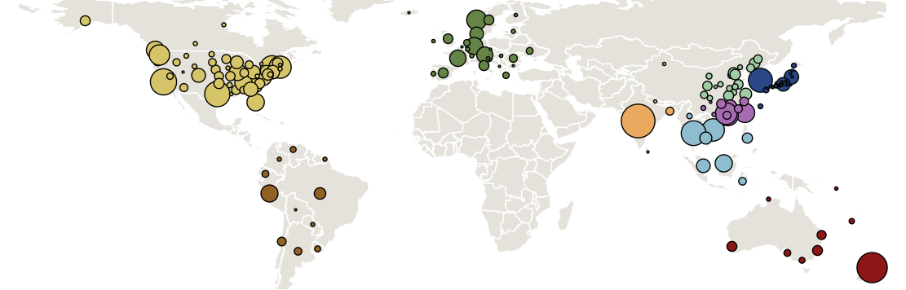
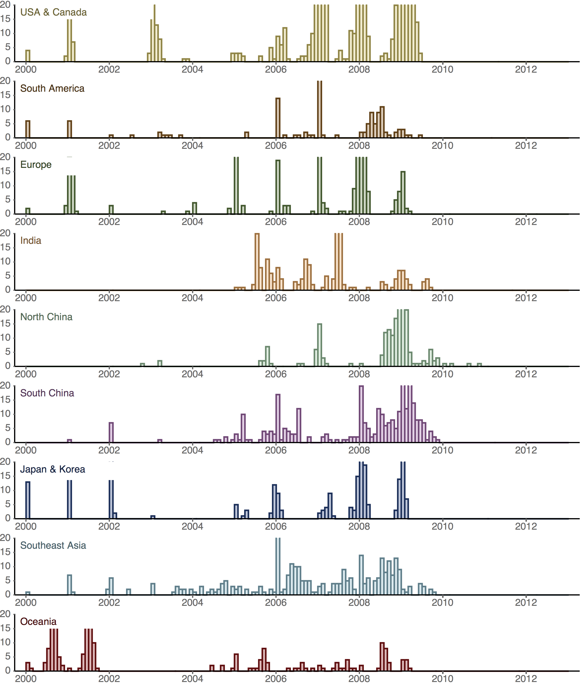
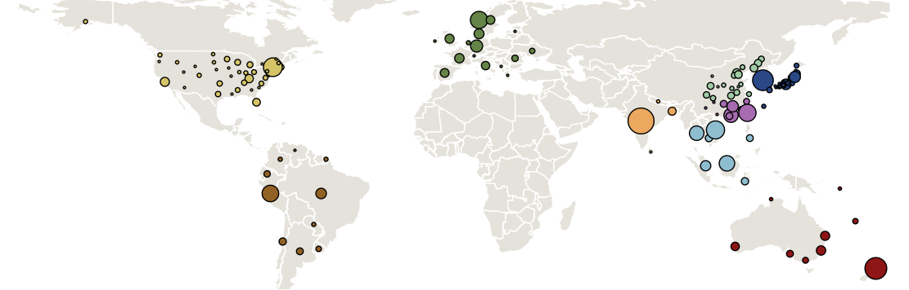
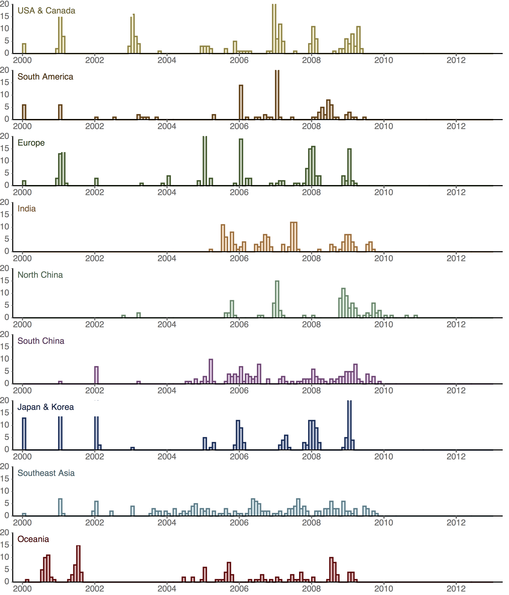
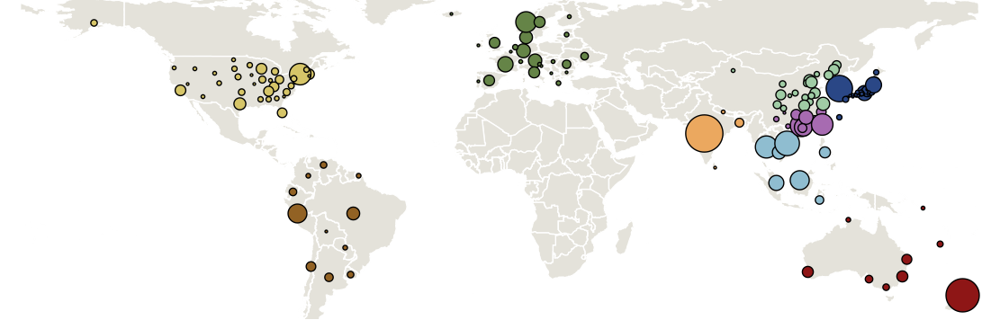
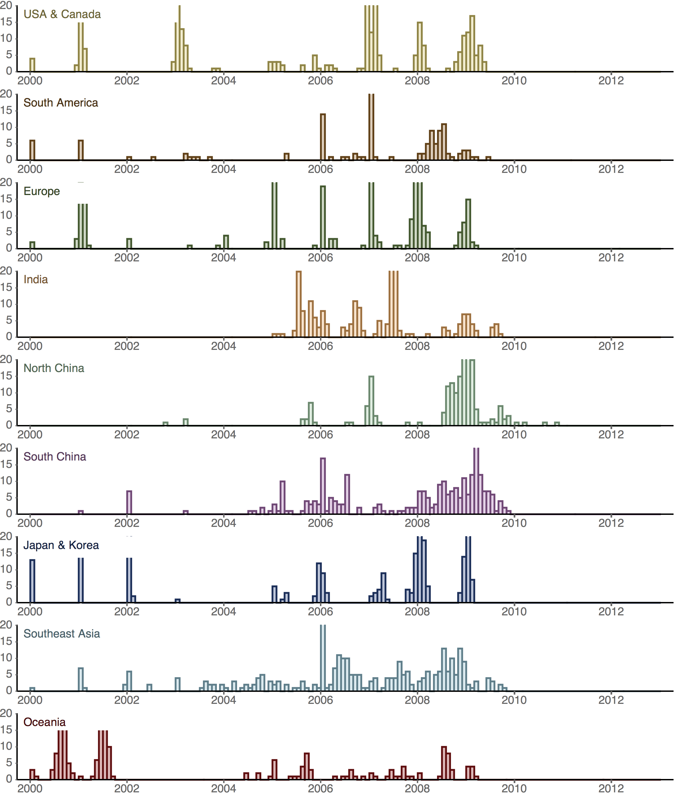

## Sampling distribution in H1N1

Region        | Full | Small | Large
------------- | ---- | ----- | -----
USACanada     | 1280 | 196   | 288
SouthAmerica  | 126  | 105   | 126
Europe	      | 369  | 180   | 277
India	      | 209  | 129   | 209
NorthChina	  | 210  | 107   | 205
SouthChina	  | 308  | 149   | 267
JapanKorea	  | 255  | 184   | 255
SoutheastAsia | 332  | 177   | 289
Oceania	      | 229  | 145   | 228
Total         | 3318 | 1372  | 2144

### Full dataset

### Small dataset

### Large dataset

