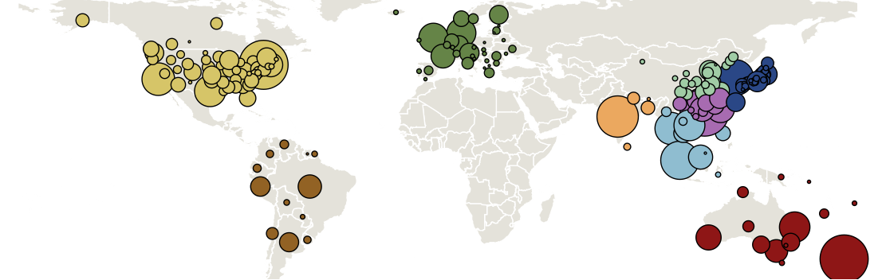
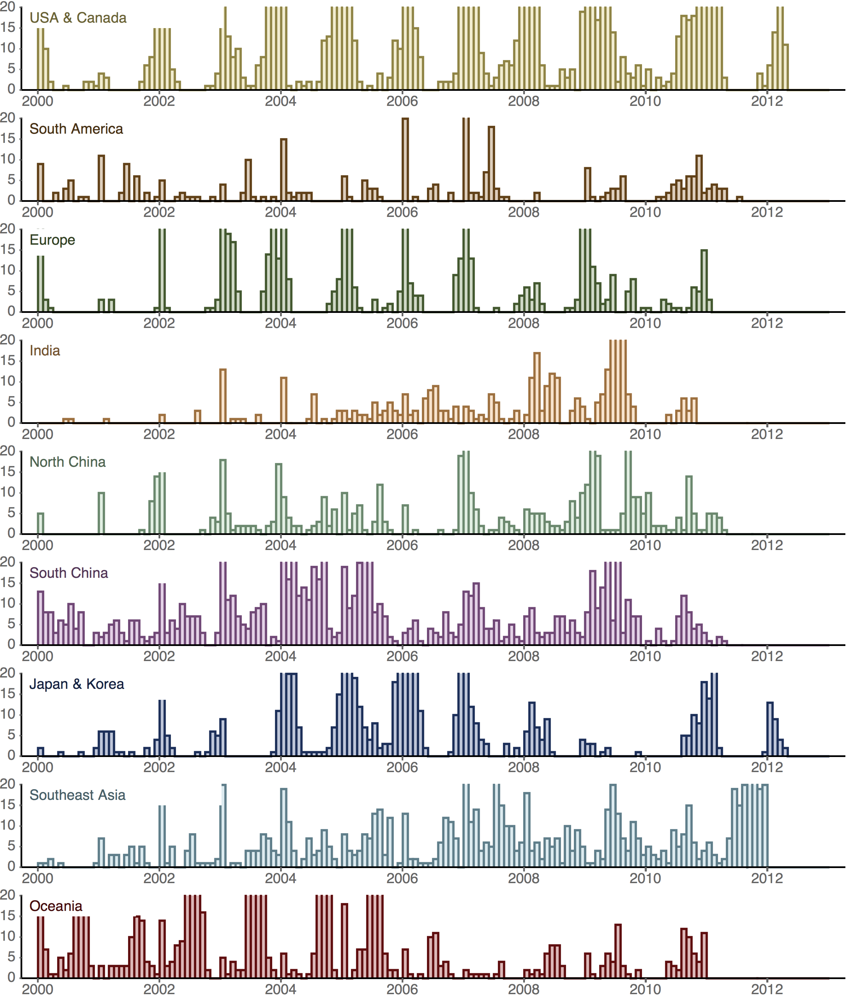
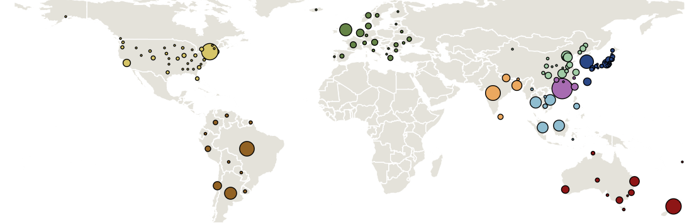
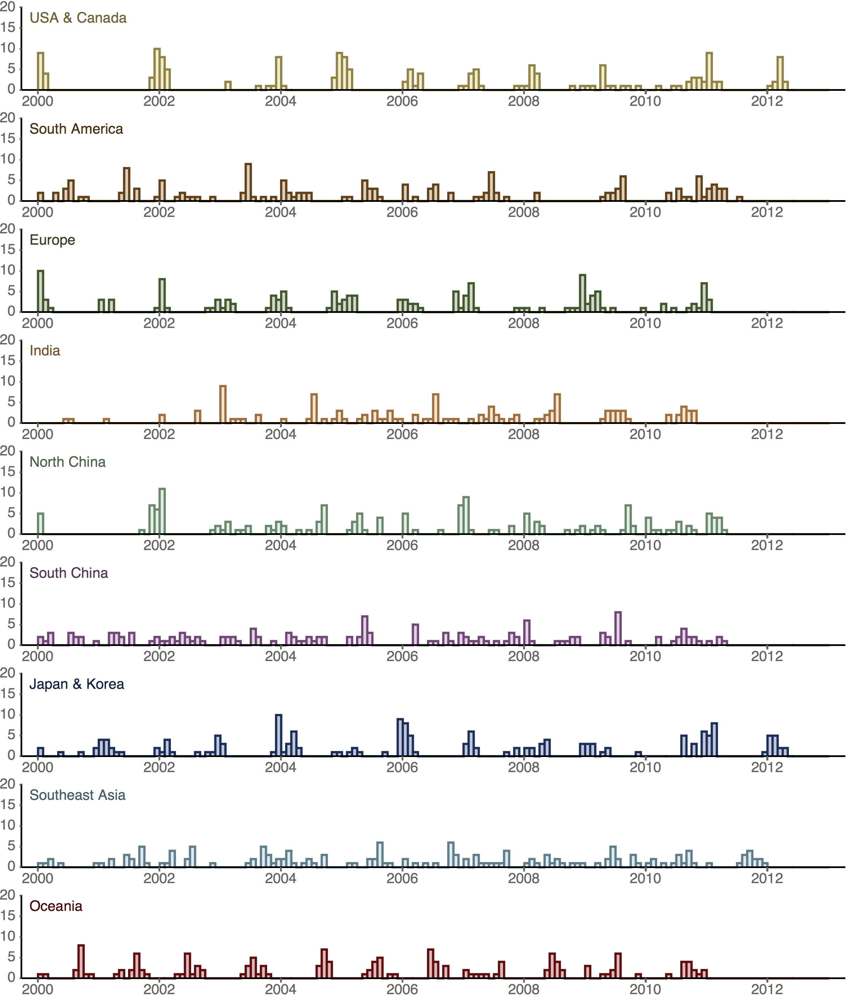
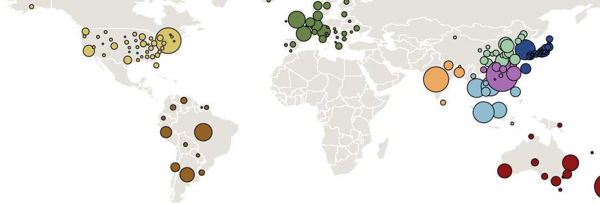
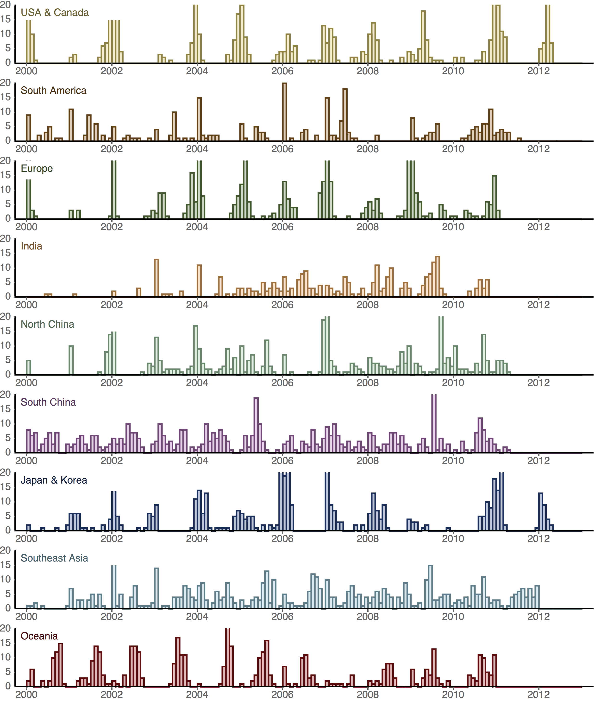

## Sampling distribution in H3N2

Region        | Full | Small | Large
------------- | ---- | ----- | -----
USACanada     | 2298 | 169   | 520
SouthAmerica  |	326  | 154   | 287
Europe	      | 872  | 150   | 489
India	      | 387  | 120   | 276
NorthChina	  | 544  | 159   | 441
SouthChina	  | 1015 | 158   | 531
JapanKorea	  | 980  | 170   | 459
SoutheastAsia | 882  | 160   | 534
Oceania	      | 1002 | 151   | 469
Total         | 8306 | 1391  | 4006

### Full dataset

### Small dataset

### Large dataset

