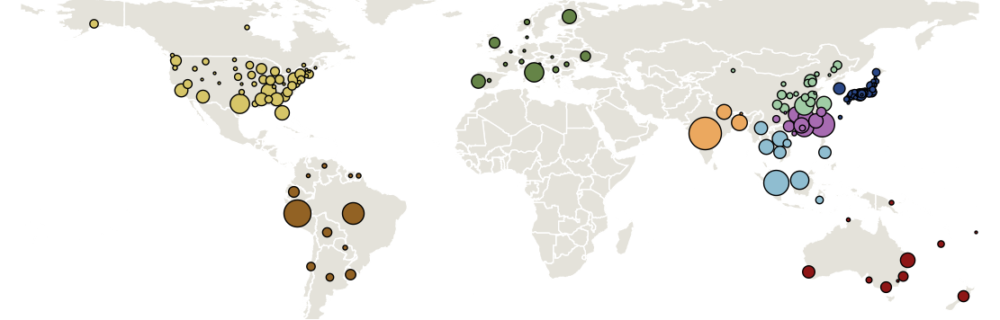
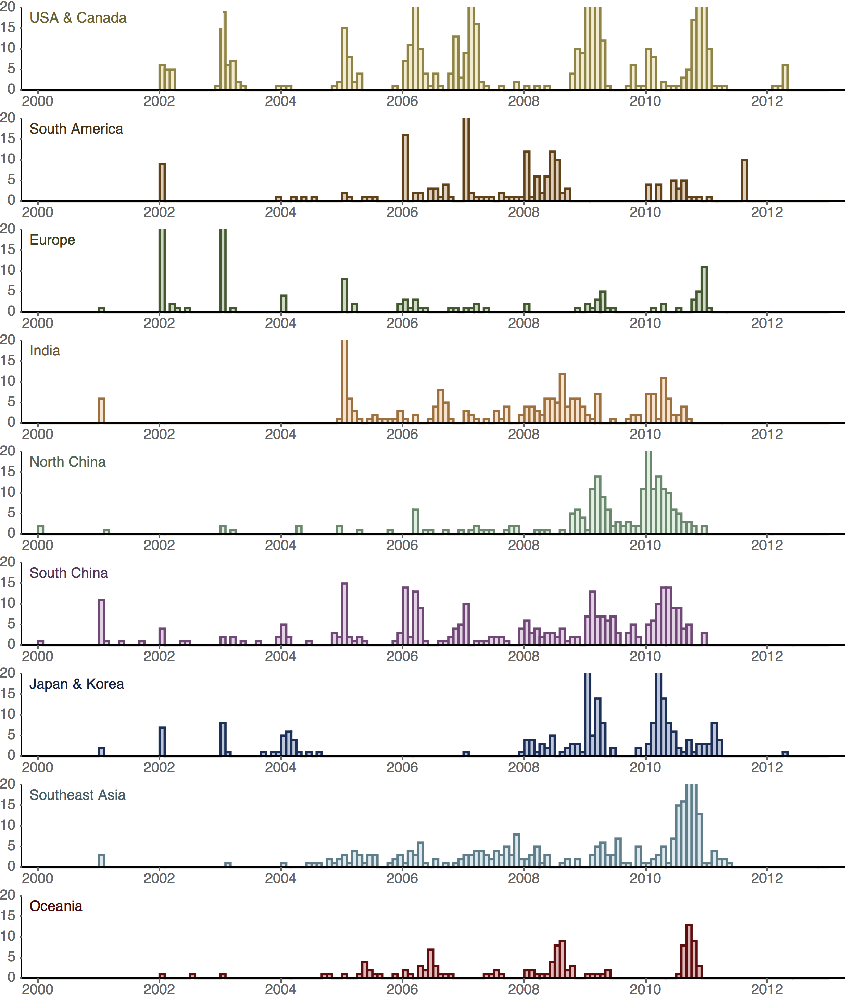
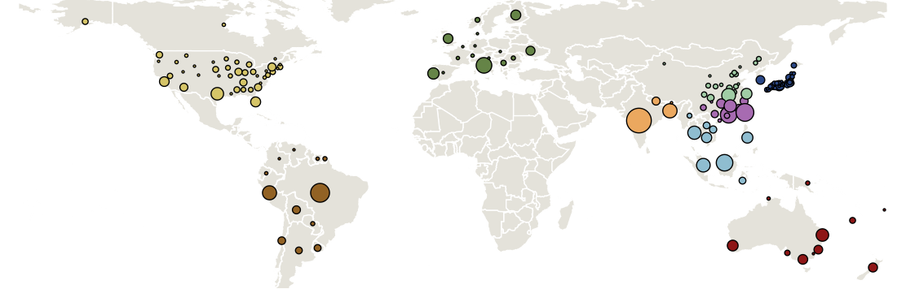
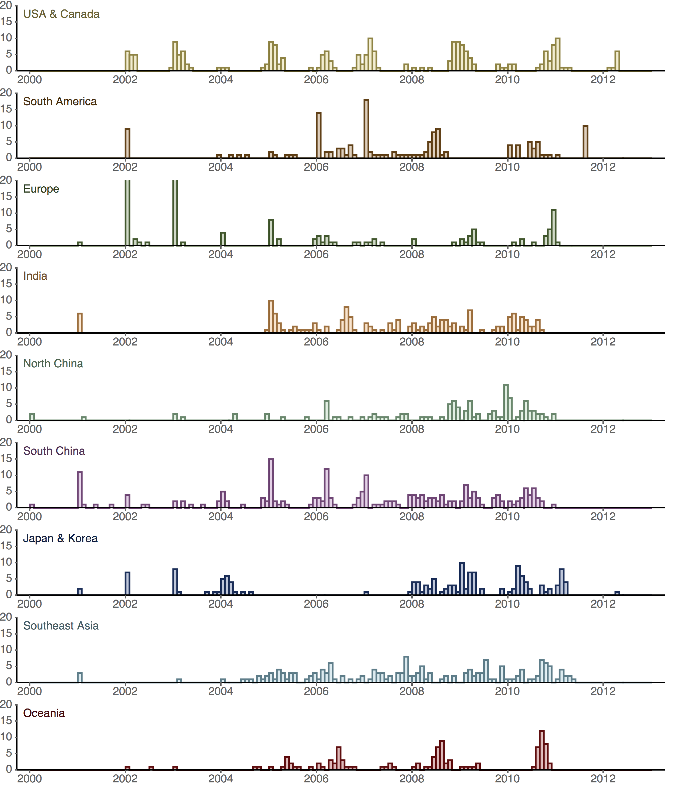
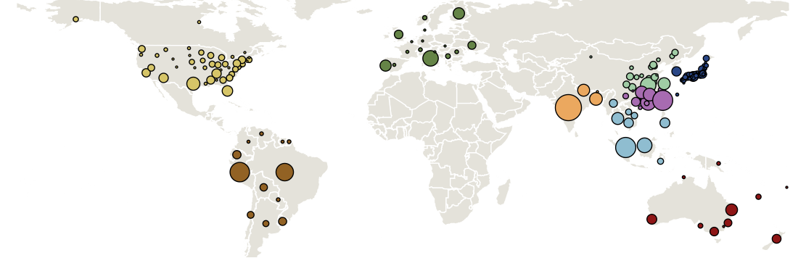
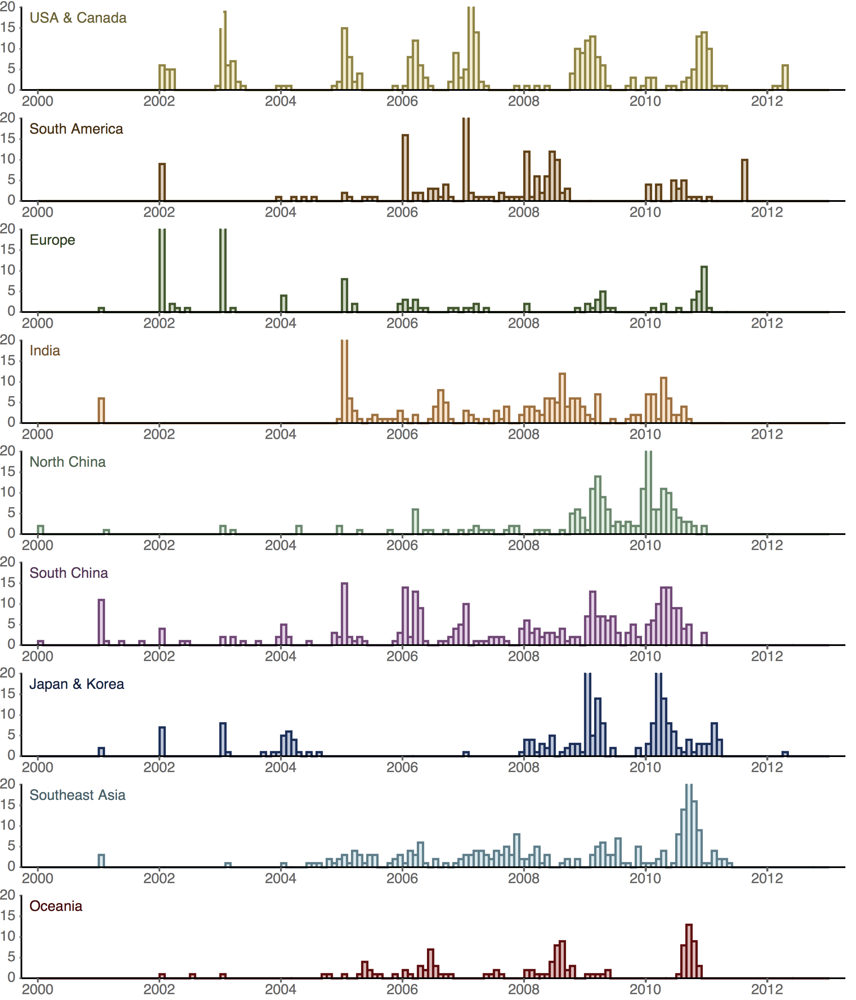

## Sampling distribution in B/Vic

Region        | Full | Small | Large
------------- | ---- | ----- | -----
USACanada     | 482  | 211   | 315
SouthAmerica  |	243  | 144   | 220
Europe	      | 161  | 133   | 161
India	      | 215  | 152   | 215
NorthChina	  | 219  | 112   | 198
SouthChina	  | 314  | 211   | 314
JapanKorea	  | 215  | 146   | 215
SoutheastAsia | 283  | 177   | 246
Oceania	      | 115  | 108   | 115
Total         | 2247 | 1394  | 1999

### Full dataset

### Small dataset

### Large dataset

