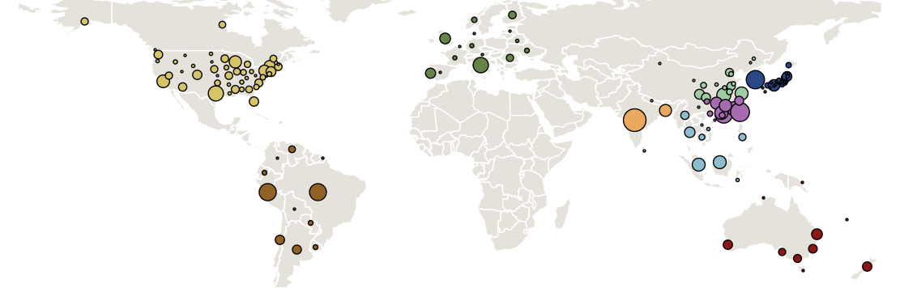
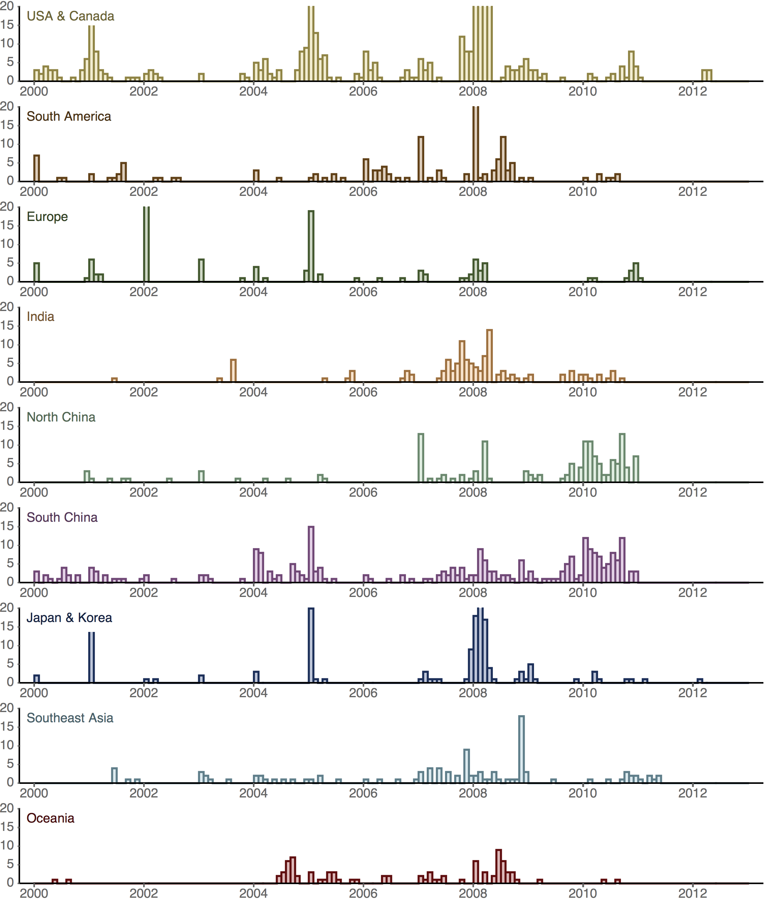
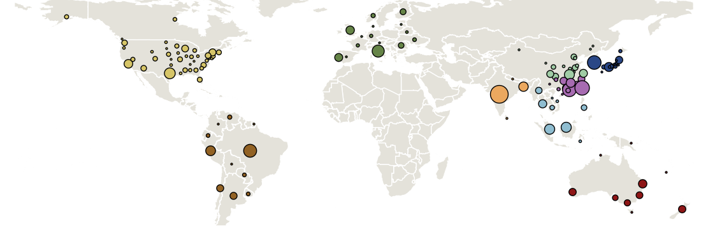
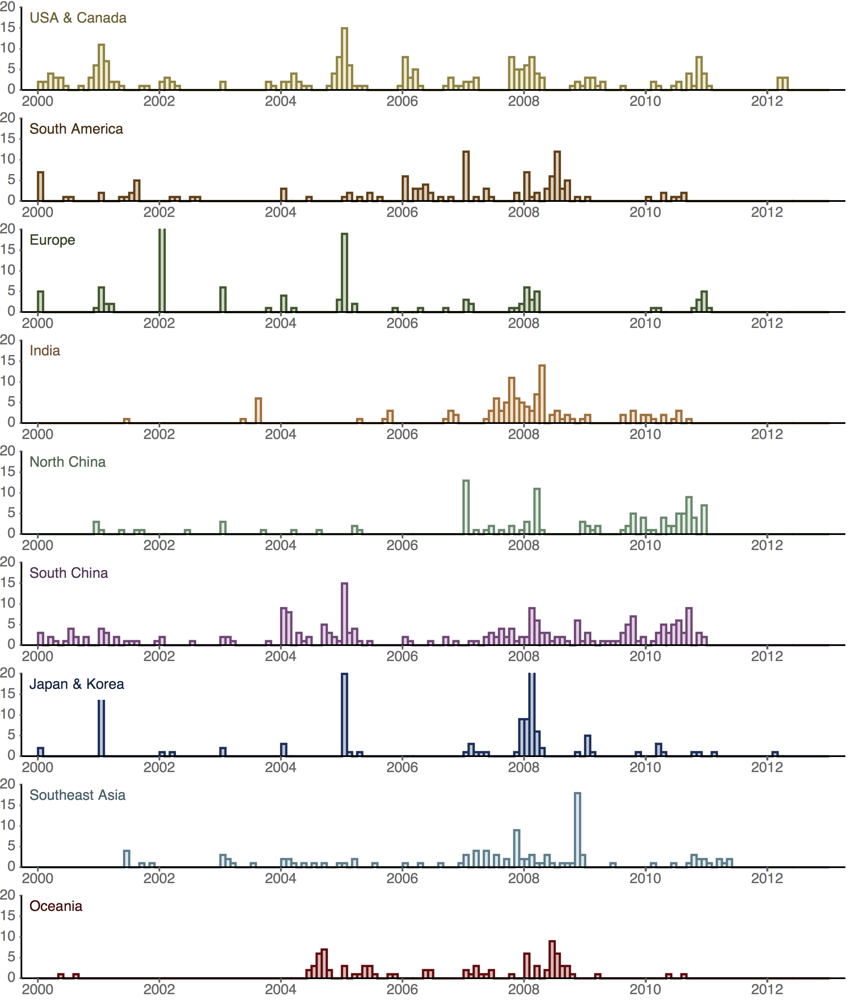
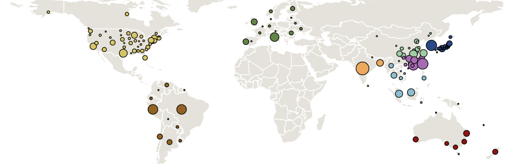
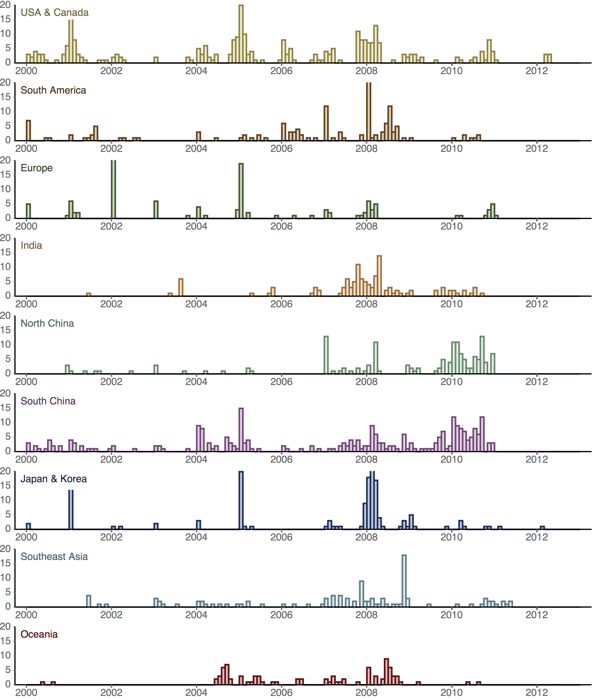

## Sampling distribution in B/Yam

Region        | Full | Small | Large
------------- | ---- | ----- | -----
USACanada     | 402  | 226   | 302
SouthAmerica  | 153  | 122   | 153
Europe	      | 120  | 120   | 120
India	      | 116  | 116   | 116
NorthChina	  | 146  | 113   | 146
SouthChina	  | 263  | 226   | 263
JapanKorea	  | 159  | 121   | 159
SoutheastAsia | 109  | 109   | 109
Oceania	      | 87   | 87    | 87
Total         | 1555 | 1240  | 1455

### Full dataset

### Small dataset

### Large dataset

