## Tree

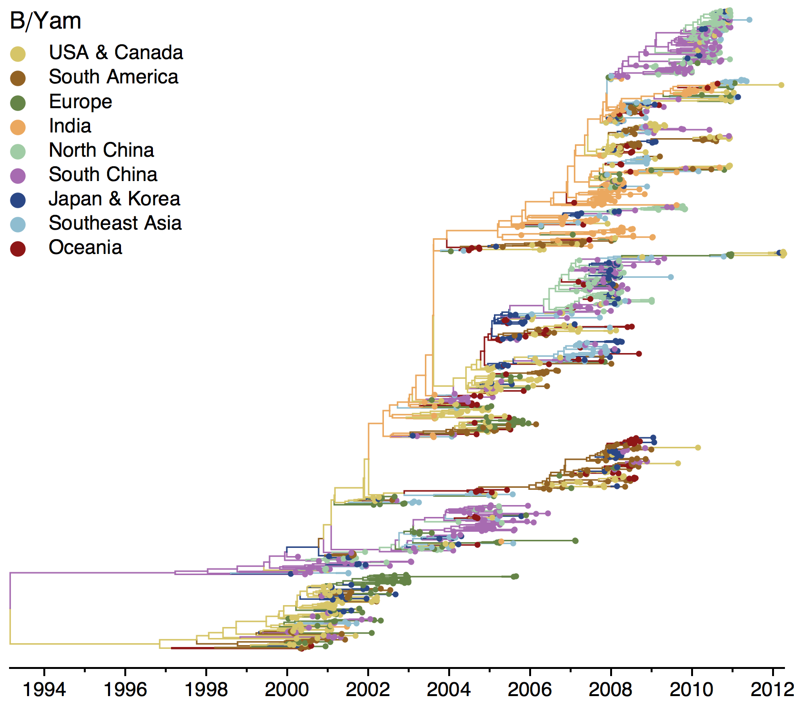

## Map

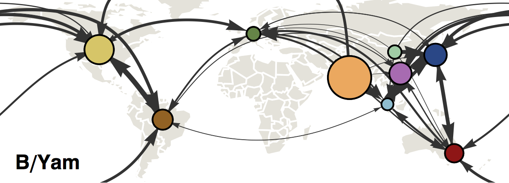

## Grid

This shows the [table of pairwise migration rates](stats/yam_small_geo_mig.tsv).

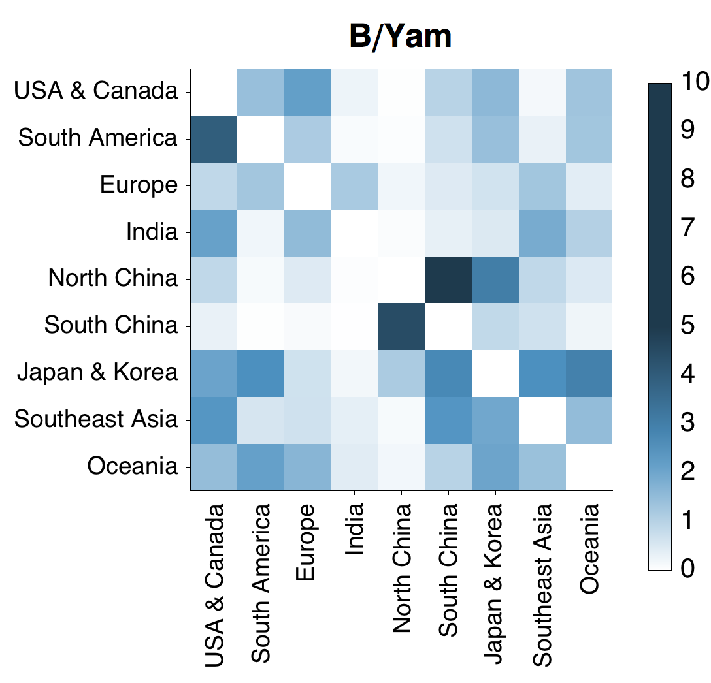

## Ancestry

### Regional ancestry

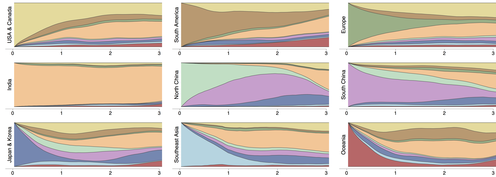

## Subtrees

### USA tree

### South America tree

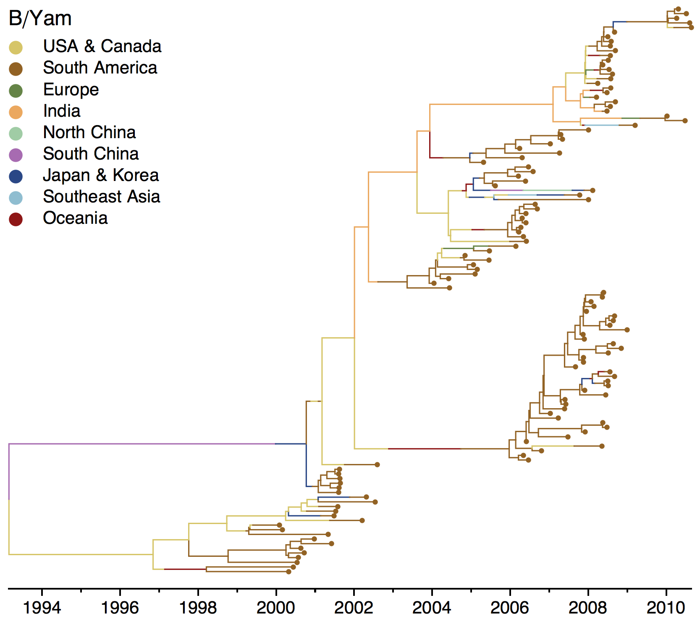

### Europe tree

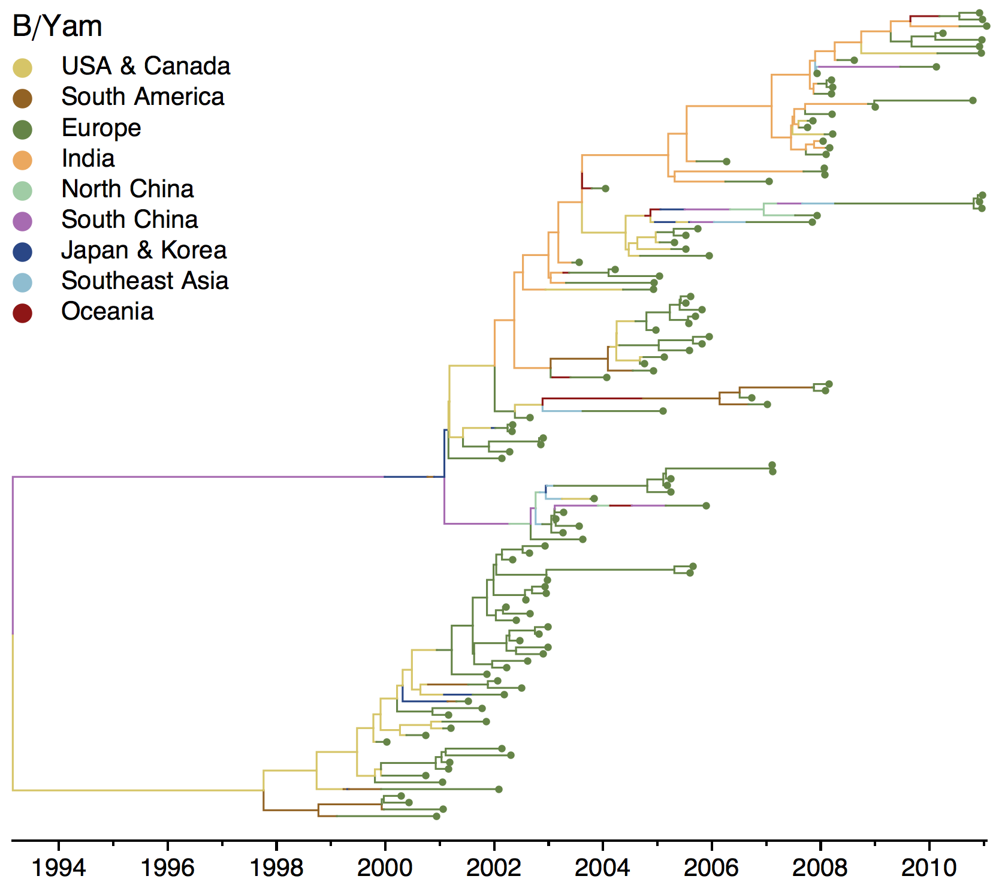

### India tree

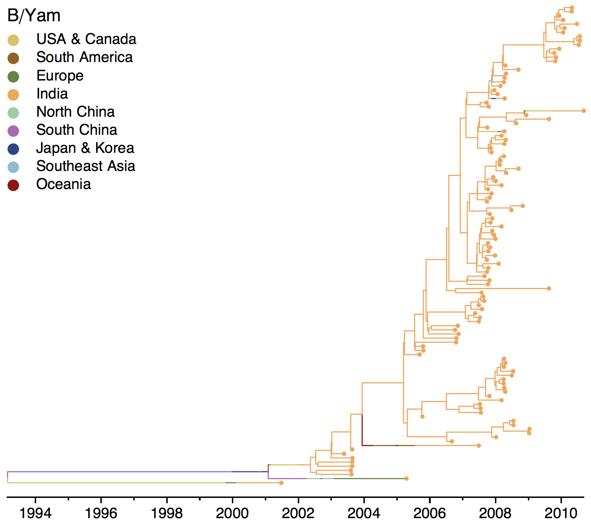

### North China tree

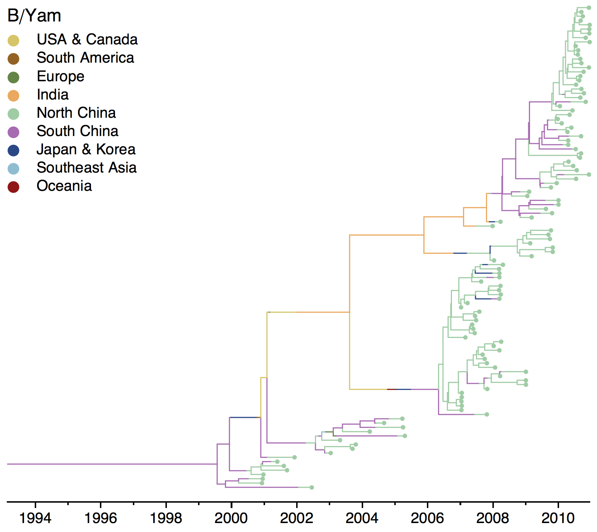

### South China tree

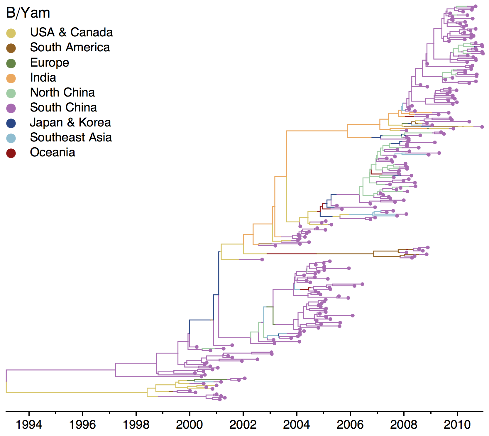

### Japan and Korea tree

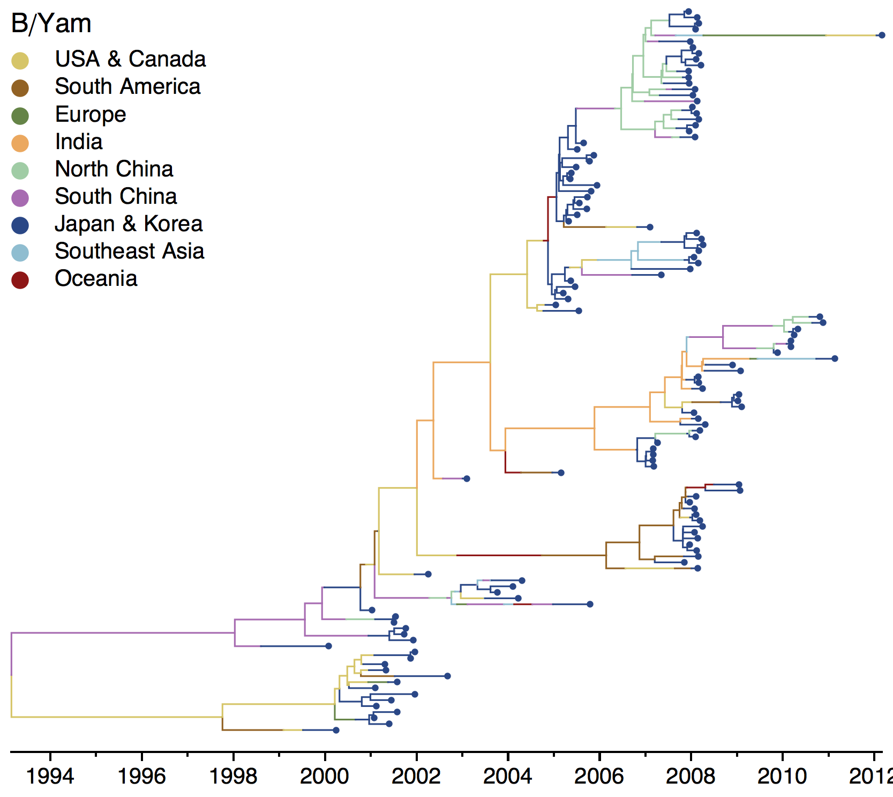

### Southeast Asia tree

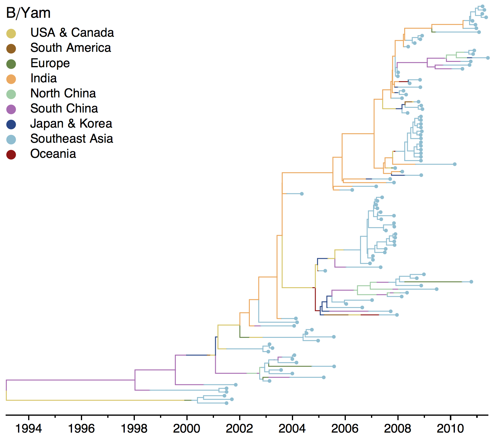

### Oceania tree

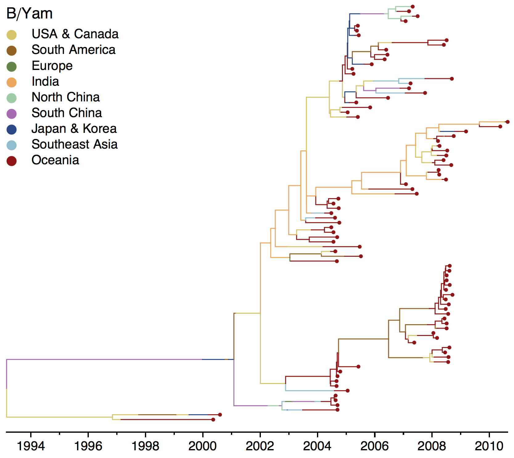
