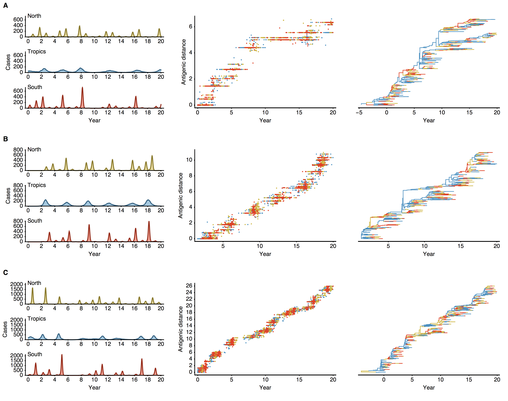

## Simulation

Model source code can be found in the [antigen](https://github.com/trvrb/antigen) repository.  The exact code to produce these simulations is [antigen.jar](antigen.jar).  This requires Java 1.7 to compile and running the simulation with 45 million hosts requires a lot of memory.  To run, navigate to a directory with `parameters.yml` and type:

	java -Xmx22G -jar ../../antigen.jar Antigen

This will load in the `parameters.yml` and output `out.branches`, `out.summary`, `out.timeseries`, `out.tips` and `out.trees`.  Estimation of summary statistics (like migration rate) requires additional post-processing.  The file `out.stats` is computed by running the Mathematica notebook `scripts/antigen-analysis.nb`.

The summary figure is created from the entire set of `out.stats` files by the Mathematica notebook `scripts/summary.nb`.

Model are parameterized with 3 demes and 2 age compartments:

* [With equal mixing between compartments.](replicate_1/antigen_mu_0.00005_eq_1/parameters.yml) 
* [With faster mixing of adults.](replicate_1/antigen_mu_0.00005_diff_1/parameters.yml) 

## Model dynamics

